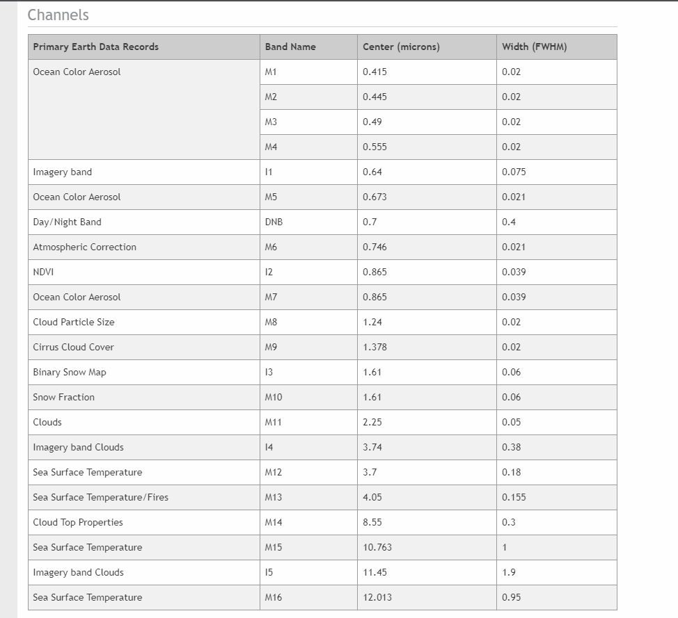

# Rudimentary fire detection algorithm for the VIIRS sensor onboard Suomi-NPP satellite

## Contents : 
* [Task Information](#task-information)
* [Tools Used](#tools-used)
* [Data Information](#data-information)
* [Understanding the Data set](#understanding-the-data)
* [Finding Hotspots](#finding-hotspots)
* [Output](#output)
* [References](#references)
  
## Task Information 

* Rudimentary fire detection algorithm for the VIIRS sensor onboard Suomi-NPP satellite

## Tools Used
* `Pycharm Professional` - For writing python scripts. 
* `github` - Version Controlling (Private Repository)
* `Python Packages used` : Geopandas, Pandas, Matplotlib, KeplerGl.
 
## Data Information 
Satellite data was picked up from [here](https://drive.google.com/drive/folders/10A4opHjdt99LrdI_IhKglB3d1G2jWa0X?usp=sharing)
- Each satellite overpass consists of two NetCDF files:
1. File starting with VNP02 contains observation data (radiance recorded by the sensor)
2. File starting with VNP03 contains geolocation data (the geographical coordinates of each pixel in the
observation data file)

## Understanding the data
* The dataset (.nc) was comparatively very new for me, hence I had to understand the data and the satellite image. I used few references to understand the data. [[1]](#1) [[2]](#2) [[3]](#3) 
* I found the bands information on Wikipedia [[4]](#4) and NASA Website [[5]](#5).
 

## Finding Hotspots
* I tried to run a filter and store the image in the `output\binarythreshold_image.png` but my system was really low on memory and it started to freeze. 
* I converted all the data into a dataframe (And GeoDataFrame) and manually filtered the fire_radiance value >0.85 to detect hotspots. 

## Output

* The output of the hotspots locations from the KeplerGL is stored in `output\hotspots_locations.html`. 
* The images of the hotspots locations from the KeplerGL is stored in `output\hotspot_heatmap_densitybased.png`, `output\hotspot_heatmap_radiancebased.png` and `output\hotspot_points_keplergl.png`
* The hotspots location in the csv format is stored in `output\hotspots_locations.csv`.
* The hotspots location in the geojson format is stored in `output\hotspots_locations.geojson`.

## References 

* <a id="1">[1]</a> 
https://towardsdatascience.com/read-netcdf-data-with-python-901f7ff61648
* <a id="2">[2]</a> 
https://joehamman.com/2013/10/12/plotting-netCDF-data-with-Python/
* <a id="3">[3]</a> 
https://www.earthinversion.com/utilities/reading-NetCDF4-data-in-python/
* <a id="4">[4]</a>
https://en.wikipedia.org/wiki/Visible_Infrared_Imaging_Radiometer_Suite
* <a id="5">[5]</a>
https://ladsweb.modaps.eosdis.nasa.gov/missions-and-measurements/viirs/
* <a id="6">[6]</a>
http://schubert.atmos.colostate.edu/~cslocum/netcdf_example.html
* <a id="7">[7]</a>
extension://bfdogplmndidlpjfhoijckpakkdjkkil/pdf/viewer.html?file=https%3A%2F%2Flpdaac.usgs.gov%2Fdocuments%2F133%2FVNP14_ATBD.pdf
* <a id="8">[8]</a>
https://www.youtube.com/watch?v=Qu_givjJzds
* <a id="9">[9]</a>
https://scikit-image.org/docs/0.13.x/auto_examples/xx_applications/plot_thresholding.html

