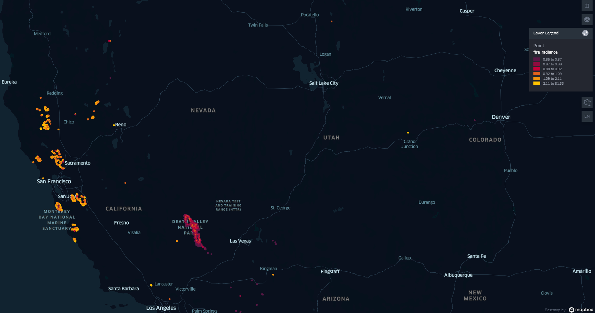

# Aman_GIS_OroraTech_Challenge
Rudimentary fire detection algorithm for the VIIRS sensor onboard Suomi-NPP satellite

## Questions? 

* VIIRS Image
Hot Pixels or Hot Spots
  

## Data Information 
https://drive.google.com/drive/folders/10A4opHjdt99LrdI_IhKglB3d1G2jWa0X

https://towardsdatascience.com/read-netcdf-data-with-python-901f7ff61648
https://joehamman.com/2013/10/12/plotting-netCDF-data-with-Python/
https://www.earthinversion.com/utilities/reading-NetCDF4-data-in-python/
https://stackoverflow.com/a/28430599/14723389
https://www2.atmos.umd.edu/~cmartin/python/examples/netcdf_example1.html
https://www.youtube.com/watch?v=K1_8EqCJlwo
https://www.youtube.com/watch?v=VH-PCQ991fw
http://schubert.atmos.colostate.edu/~cslocum/netcdf_example.html
extension://bfdogplmndidlpjfhoijckpakkdjkkil/pdf/viewer.html?file=https%3A%2F%2Flpdaac.usgs.gov%2Fdocuments%2F133%2FVNP14_ATBD.pdf
https://www.youtube.com/watch?v=Qu_givjJzds
https://scikit-image.org/docs/0.13.x/auto_examples/xx_applications/plot_thresholding.html

Bands Information 

https://ladsweb.modaps.eosdis.nasa.gov/missions-and-measurements/viirs/
https://en.wikipedia.org/wiki/Visible_Infrared_Imaging_Radiometer_Suite

